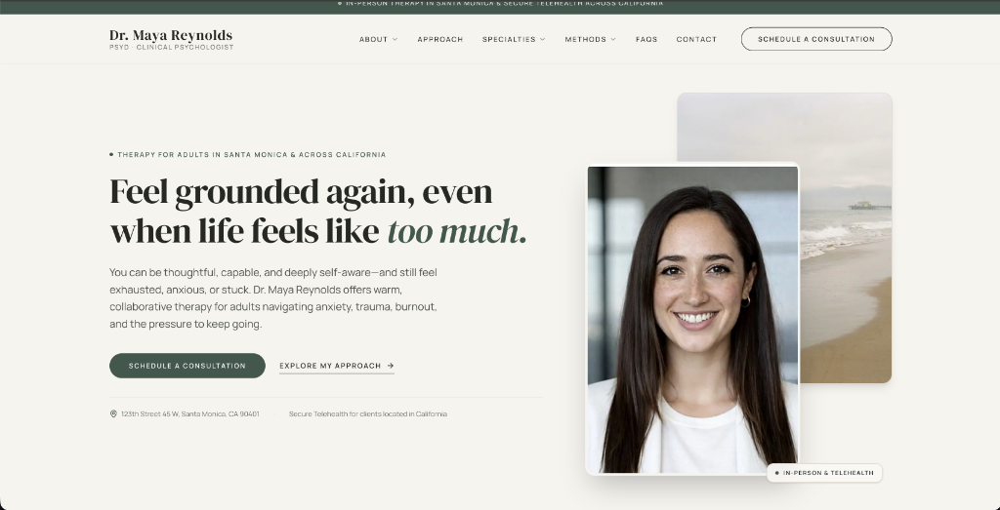
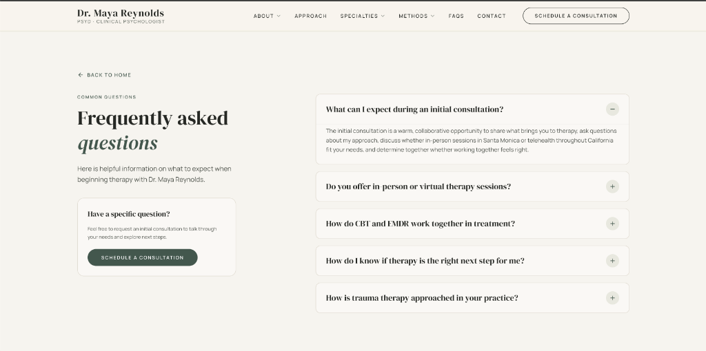
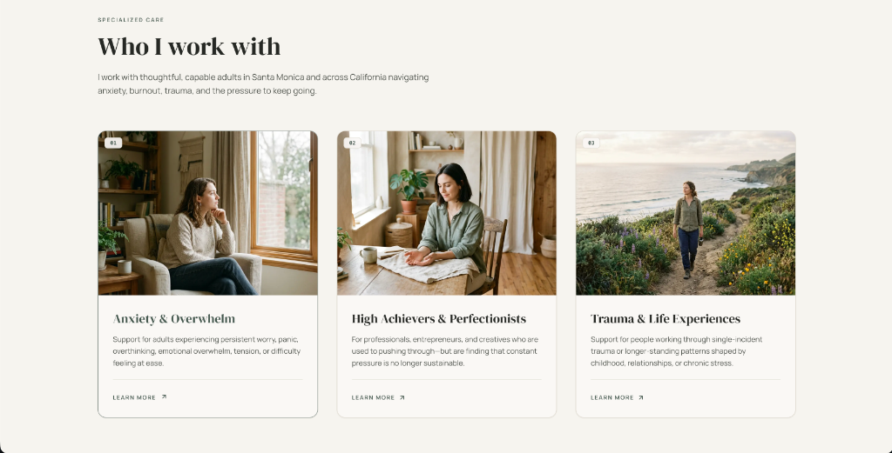
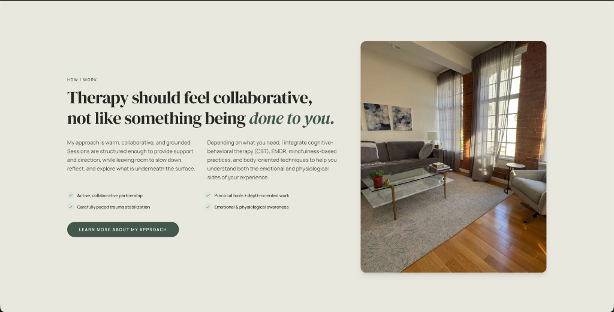

<div align="center">

# Dr. Maya Reynolds, PsyD
### Licensed Clinical Psychologist · Santa Monica, California

An editorial, high-fidelity therapist practice web application engineered for clinical credibility, emotional grounding, and responsive storytelling.

[](https://growmytherapydemo.vercel.app/)
[](https://nextjs.org/)
[](https://react.dev/)
[](https://www.typescriptlang.org/)
[](https://tailwindcss.com/)
[](https://www.framer.com/motion/)

**[Explore Live Deployment ↗](https://growmytherapydemo.vercel.app/)** · [Interface Previews](#-interface-previews) · [Key Features](#-key-features) · [Design System](#-design-system--editorial-identity) · [Information Architecture](#-information-architecture) · [Getting Started](#-getting-started)

</div>

---

## 🌿 Executive Overview

This web application represents a bespoke digital presence designed for **Dr. Maya Reynolds, PsyD**, a licensed clinical psychologist based in Santa Monica, California. The practice offers in-person therapy in Santa Monica alongside secure statewide telehealth for clients located in California.

The application blends **clinical warmth and clarity** with an **editorial design architecture**, drawing inspiration from contemporary editorial and wellness design systems. It prioritizes:
- **Atmospheric Storytelling**: Soft earth tones, typography pairing with editorial serif headlines, and deliberate whitespace pacing.
- **Asymmetric Composition**: Staggered image pairings on desktop that recompose into balanced vertical hierarchies on tablet and mobile viewports.
- **Accessible, Human-First Interactions**: Standard WAI-ARIA accordions on `/faqs`, keyboard-dismissible consultation modal dialogs, hierarchical mobile navigation, and responsive touch targets.

---

## 📸 Interface Previews

| Homepage Hero & Staggered Composition | Interactive FAQs (`/faqs`) |
| :---: | :---: |
|  |  |
| *Desktop hero with asymmetric editorial photo pairing, consultation CTA, and practice location note.* | *Accordion FAQ interface with single-item expansion, fluid Framer Motion transitions, and inquiry card.* |

| Target Client Profiles ("Who I Work With") | Collaborative Clinical Philosophy ("How I Work") |
| :---: | :---: |
|  |  |
| *Three-column editorial cards with numbered monospaced tags for Anxiety, Burnout, and Trauma.* | *Dual-column narrative detailing collaborative clinical care, modality checklist, and Santa Monica office.* |

---

## ✨ Key Features

### 1. Editorial Navigation & Drawer Choreography
- **Desktop Navigation**: Sticky header featuring practice typography, interactive hover/click dropdown menus for *About*, *Specialties*, and *Methods*, cross-route anchor jumps, and an instant Consultation CTA.
- **Sliding Multi-Level Mobile Menu**: Full-screen slide-over drawer with drill-down nested submenus (`About`, `Specialties`, `Methods`), complete with directional back navigation (`← Back to Menu`), body scroll lock when active, and Escape-key dismissal.
- **Cross-Route Anchor Jumps**: Root-relative anchor targeting (`/#intro`, `/#specialties`, `/#methods`, `/#office`, `/#contact`) allowing seamless section transitions from both the homepage root and the dedicated `/faqs` route.

### 2. Intentional Responsive Recomposition
- **Viewport-Specific Layouts**: Verified across 9 device breakpoints (375px, 390px, 414px, 430px, 768px, 834px, 1024px, 1280px, and 1440px).
- **Portrait Preservation**: Maya's vertical portrait is framed within dedicated `3:4` aspect-ratio containers on mobile and CTA cards, preserving face, hair, and upper torso framing without awkward horizontal cropping.
- **Overflow Protection**: Zero horizontal scroll across all breakpoints; structured container paddings via `clamp(1.25rem, 5vw, 4.5rem)`.

### 3. Accessible FAQ Experience (`/faqs`)
- **Fluid Accordions**: Single-expansion toggle pattern with animated height interpolation via Framer Motion.
- **WAI-ARIA Structure**: Connected `aria-expanded`, paired `aria-controls` / `id`, and panel `role="region"` with `aria-labelledby` attributes for assistive technology and tabbed keyboard navigation.

### 4. Interactive Consultation Dialog
- **Modal Dialog Ergonomics**: Accessible modal dialog with backdrop blur, spring scaling, close button, and click-outside dismissal.
- **Keyboard Dismissal & Scroll Lock**: Native `Escape` key event listener for quick dismissal and programmatic body scroll locking (`overflow: hidden`) during dialog display.
- **Form State Handling**: Real-time format toggle (*Santa Monica Office* vs. *California Telehealth*), field state tracking, disabled submission state (`isSubmitting`) during simulated dispatch, and automatic form reset on modal close.

---

## 🎨 Design System & Editorial Identity

The visual language balances clinical trust with Santa Monica architectural serenity.

### Curated Color Palette
```text
┌─────────────────────────────────────────────────────────────┐
│ #F7F4EE │ Primary Warm Stone Base (Page Background)         │
│ #E8E8DF │ Secondary Sand Muted Surface                      │
│ #FAF8F5 │ High-Key Warm Card Surface                        │
│ #43574D │ Deep Sage / Forest Accent (Primary Actions)       │
│ #A9B7A8 │ Soft Olive Sage (Secondary Accents / Badges)      │
│ #252824 │ Charcoal Umber (High-Contrast Editorial Text)     │
│ #4A4F48 │ Deep Slate Neutral (Subtle Body Text)             │
│ #DDD8CE │ Muted Stone Border Line                           │
└─────────────────────────────────────────────────────────────┘
```

### Typography Hierarchy
- **Serif Display**: `DM Serif Display` via `next/font/google` — Lends editorial authority, human warmth, and reflective pacing to section titles and headlines.
- **Sans-Serif System**: `Manrope` via `next/font/google` — Clean geometric sans-serif optimized for reading legibility, metadata labels, navigation, and touch targets.
- **Monospace Accents**: Monospaced numerical indices (`01`, `02`, `03`) for numbered specialties and clinical approaches.

---

## 🏛 Information Architecture

The website is organized into an editorial flow that guides prospective clients from initial orientation to practical clinical details:

```text
Homepage (/)
│
├── 1. Announcement Bar       -> Santa Monica & California Telehealth Availability Strip
├── 2. Header & Navigation    -> Logo, Dropdowns (About, Specialties, Methods), Consultation CTA
├── 3. Hero Section           -> Editorial Staggered Layout / Recomposed Mobile 3/4 Portrait
├── 4. Intro & Philosophy     -> Grounded Care Narrative & Shoreline Reflection
├── 5. Alternating Narrative  -> Two-Row Image + Text Storytelling (Emotional & Physiological Sides)
├── 6. Who I Work With        -> 3-Card Editorial Focus Areas (Anxiety, Burnout, Trauma)
├── 7. Statement Banner       -> Full-Width Dusk Atmosphere & Reflective Statement
├── 8. Areas of Expertise     -> Editorial Index & 12 Focus Areas with Numbered Badges
├── 9. How I Work (Approach)  -> Collaborative Philosophy, Checkpoint Highlights & Modalities
├── 10. Architectural Loft    -> Practice Interior Feature & Perspective Statement
├── 11. Clinical Methods      -> Therapeutic Modalities (CBT, EMDR, Mindfulness, Body-Oriented)
├── 12. Office & Practice     -> Santa Monica Office Gallery & In-Person / Telehealth Cards
├── 13. Consultation CTA     -> Split Editorial Card with Dr. Reynolds Portrait & Inquiry Trigger
├── 14. Welcoming Sign-off    -> Location Confirmation Strip
└── 15. Multi-Column Footer   -> Navigation, Focus Areas, Verbatim Office Address & Legal Notes

Dedicated Route
└── /faqs                     -> Frequently Asked Questions (WAI-ARIA Accordions & Direct CTA)

Interactive Dialog
└── ConsultationModal         -> Inquiry Modal with In-Person/Telehealth Choice & Field Validation
```

---

## 🛠 Tech Stack

| Layer | Technology | Version | Purpose |
| :--- | :--- | :--- | :--- |
| **Framework** | **Next.js** | `16.3.6` | App Router, static site generation, Turbopack dev & build |
| **UI Library** | **React** | `19.2.8` | Component rendering, state hooks, and client-side interactions |
| **Language** | **TypeScript** | `5.x` (`^5`) | Strict type checking for component props, events, and data models |
| **Styling** | **Tailwind CSS** | `v4.x` (`^4`) | Modern utility engine with CSS variable tokens via `@tailwindcss/postcss` |
| **Animation** | **Framer Motion** | `13.4.4` (`^13.4.4`) | Accordion height interpolation, mobile drawer transitions, and modals |
| **Icons** | **Lucide React** | `1.48.0` (`^1.48.0`) | Accessible SVG icons (`MapPin`, `Video`, `Calendar`, `X`, `ChevronDown`, etc.) |
| **Typography** | **Google Fonts** | `next/font/google` | Zero-layout-shift font optimization for `DM Serif Display` and `Manrope` |
| **Deployment** | **Vercel** | Edge Platform | Global CDN distribution, optimized image handling, and continuous delivery |

---

## 📁 Repository Structure

```text
├── app/
│   ├── faqs/
│   │   └── page.tsx              # Accessible FAQ page with interactive accordions
│   ├── favicon.ico               # Practice favicon asset
│   ├── globals.css               # Design system tokens, typography rules & base styles
│   ├── layout.tsx                # Root layout, Google fonts & JSON-LD schema
│   └── page.tsx                  # Primary editorial homepage choreography
├── components/
│   ├── AlternatingSection.tsx    # Two-row editorial image/text storytelling
│   ├── AnnouncementBar.tsx       # Availability notification strip
│   ├── ApproachSection.tsx       # "How I Work" clinical integration & check-list
│   ├── ClosingStatement.tsx      # Location confirmation strip
│   ├── ConsultationCTA.tsx       # Bottom prominent consultation card & portrait
│   ├── ConsultationModal.tsx     # Accessible consultation inquiry modal dialog
│   ├── ExpertiseSection.tsx      # Numbered clinical focus areas
│   ├── Footer.tsx                # Multi-column footer with verbatim practice address
│   ├── Hero.tsx                  # Staggered desktop composition / 3:4 mobile portrait
│   ├── ImageStatementSection.tsx # Architectural photo feature with reflective statement
│   ├── IntroSection.tsx          # Grounded care philosophy & coastal shoreline photo
│   ├── MethodsSection.tsx        # Therapeutic modalities (CBT, EMDR, Mindfulness, Body-Oriented)
│   ├── MobileMenu.tsx            # Multi-level sliding navigation drawer
│   ├── Navbar.tsx                # Sticky header with hover dropdowns & mobile trigger
│   ├── OfficeSection.tsx         # Santa Monica office gallery & telehealth cards
│   ├── StatementSection.tsx      # Dusk atmosphere statement banner
│   └── WhoIWorkWith.tsx          # 3-column card architecture for target client profiles
├── public/
│   └── maya/                     # Practice photography and editorial imagery
├── screenshots/                  # Deployed UI previews for documentation
│   ├── approach-preview.png
│   ├── faqs-preview.png
│   ├── hero-preview.png
│   └── specialties-preview.png
├── eslint.config.mjs             # ESLint configuration
├── next.config.ts                # Next.js configuration
├── package.json                  # Dependencies and execution scripts
├── postcss.config.mjs            # PostCSS configuration for Tailwind CSS v4
├── tsconfig.json                 # TypeScript compiler configuration
└── README.md                     # Technical documentation & project portfolio
```

---

## 🚀 Getting Started

### Prerequisites
- **Node.js**: `>= 20.9.0` (required by Next.js 16; LTS recommended)
- **Package Manager**: `npm`, `pnpm`, or `yarn`

### Installation

1. **Clone the repository**:
   ```bash
   git clone https://github.com/KoushikSagarr/grow_my_therapy_demo.git
   cd grow_my_therapy_demo
   ```

2. **Install dependencies**:
   ```bash
   npm install
   ```

3. **Start the local development server**:
   ```bash
   npm run dev
   ```
   Open [http://localhost:3000](http://localhost:3000) in your browser.

4. **Compile for production**:
   ```bash
   npm run build
   npm run start
   ```

---

## 📱 Responsive QA Matrix

Every component has been verified across key viewport tiers:

| Viewport | Device Target | Composition Strategy |
| :---: | :--- | :--- |
| **1440px** | Large Monitor | Asymmetrical staggered compositions, generous spacing, 1480px max bounds |
| **1280px** | Standard Desktop | Full desktop navigation, 3-column cards, split CTA card layout |
| **1024px** | Laptop | Nav link spacing safety (`gap-5`), side-by-side split consultation card |
| **834px** | iPad Pro / Tablet | Transition to mobile drawer + consultation button, balanced 460px hero |
| **768px** | iPad / Tablet | Proportional card padding (`p-5`), stacked consultation card (`min-h-[460px]`) |
| **430px** | iPhone Pro Max | Recomposed vertical hero, prominent `3:4` portrait, single-column card flow |
| **414px** | iPhone Plus / XR | Single-column card stacking, touch-friendly inputs, adaptive headings |
| **390px** | iPhone 14 / 15 / 16 | 20px content gutters, thumb-accessible CTA buttons, zero horizontal scroll |
| **375px** | iPhone SE / Compact | Compact container (335px content width), no clipped typography or buttons |

---

## 🔒 Practice & Location Information

- **Therapist**: Dr. Maya Reynolds, PsyD
- **Professional Title**: Licensed Clinical Psychologist
- **Physical Office**: 123th Street 45 W, Santa Monica, CA 90401
- **Telehealth**: Secure telehealth for clients located in California
- **Focus Areas**: Anxiety, panic, trauma, burnout, perfectionism, chronic stress, emotional regulation, high internal pressure, life transitions, relationships, self-trust, and overwhelm
- **Therapeutic Modalities**: Cognitive Behavioral Therapy (CBT), EMDR, mindfulness-based practices, and body-oriented techniques

---

<div align="center">
<sub>Engineered with care and precision for clinical clarity and web excellence.</sub>
</div>
